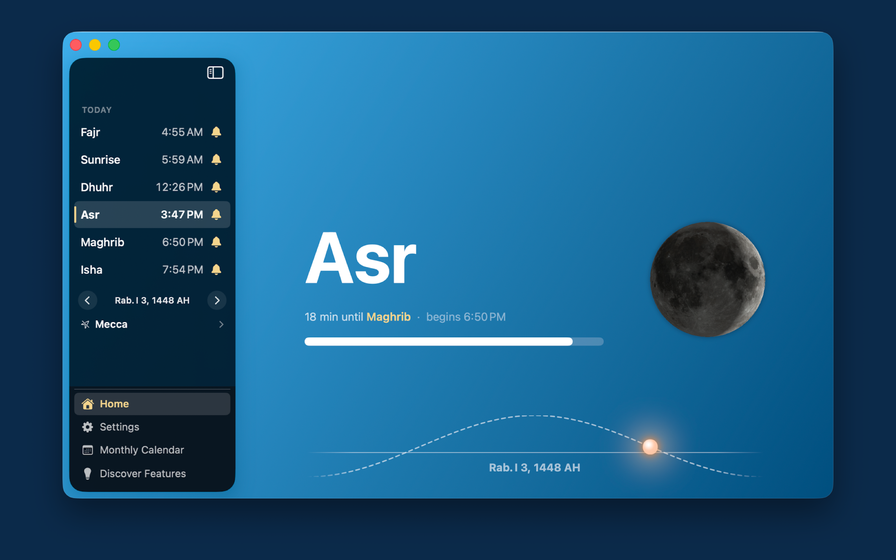

# Athan Utility

A fast, private prayer times app for iPhone, iPad, Mac, and Apple Watch.
No accounts, no ads, no data collection — every prayer time is calculated on device.

[**Download on the App Store**](https://apps.apple.com/us/app/athan-utility/id1076108131)

  

  

## Features

- **Prayer times** with 12 calculation methods, Shafi and Hanafi madhabs, high-latitude rules, and per-prayer time adjustments
- **Notifications** with multiple athan recordings, pre-prayer reminders, and a silent mode that notifies without playing the athan
- **Fajr Alarm** — a real system alarm locked to Fajr or Sunrise that follows the times through the year, with an offset for tahajjud or suhoor (iOS 26)
- **Calendar integration** — add months of prayer times to your calendar, and export the monthly view as PDF or CSV
- **Widgets** for the home screen, lock screen, StandBy, and the Smart Stack
- **Siri** — ask for the next prayer, or any prayer's time today
- **Always-on Qibla** with haptic feedback when you are aligned
- **Solar view** tracking the sun through the day, with the Hijri date
- **Ramadan suhoor timer** in the last hour before Fajr
- Customizable gradients, custom prayer name spellings, and manual coordinates when location services are off

## Platforms

| Platform | Notes |
| --- | --- |
| iPhone & iPad | Universal layout, widgets, Siri, Fajr alarms |
| Mac | Native Catalyst app with a sidebar, plus a menu bar item that counts down to the next prayer and opens a popover for quick changes |
| Apple Watch | Standalone watchOS app with complications for your watch face |
| iMessage | Sticker pack |

## Localization

Athan Utility is available in 12 languages. Prayer names and religious terminology
are reviewed per language rather than translated literally — Fajr is *İmsak* in
Turkish and *Subuh* in Indonesian and Malay, and each region's conventions are
followed rather than transliterated from English.

| Language | | Language | |
| --- | --- | --- | --- |
| Arabic | العربية | Malay | Bahasa Melayu |
| Bengali | বাংলা | Persian | فارسی |
| Chinese (Simplified) | 简体中文 | Spanish | Español |
| English | English | Turkish | Türkçe |
| French | Français | Urdu | اردو |
| German | Deutsch | Indonesian | Bahasa Indonesia |

Translations are tracked against a lockfile that records the English string each
one was translated from, so later edits to the English surface as stale rather
than drifting silently. See [`tools/LOCALIZATION.md`](tools/LOCALIZATION.md).

## Copyright

Athan Utility's code is made available to the public for transparency. Anyone may
privately use and modify the source code, but cannot use interface related code
for sale on the App Store or copy the app's likeness.

## Contribution

Contributions are wholeheartedly welcome; I hope that in continuously improving
this app, the internal reward is shared between contributions. Note that PRs are
up for discussion before merging, and are not guaranteed to be incorporated due
to time commitment.

## Acknowledgements

**Contributors**

- [Cuzeth](https://github.com/Cuzeth) — the iOS 26 AlarmKit Fajr alarm feature

**Open-source libraries**

- [Adhan](https://github.com/batoulapps/adhan-swift) — prayer time calculations, by Batoul Apps
- [WhatsNewKit](https://github.com/SvenTiigi/WhatsNewKit) — the "What's New" screen, by Sven Tiigi
- [TPPDF](https://github.com/techprimate/TPPDF) — PDF generation for calendar export, by techprimate
